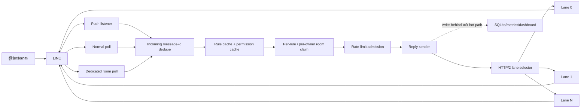

# LINE Bot Latency & Reliability Playbook

> เอกสารสรุปวิธีทำ เทคนิคด้านความเร็ว ปัญหาที่พบจริง วิธีแก้ การทดสอบ และแนวทางนำไปสร้างเว็บ/ระบบใหม่
>
> อ้างอิงสถานะโค้ด ณ วันที่ 14 สิงหาคม 2026 — commit `5e3a774`

---

## 1. บทสรุปสั้นที่สุด

ระบบตอบเร็วไม่ได้เกิดจากการลด `setTimeout` เพียงอย่างเดียว แต่ต้องลดเวลาทั้งเส้นทาง:

```text
ผู้ใช้ส่งข้อความ
  → LINE ส่ง event มาถึงเรา
  → ถอดรหัส/จับคู่กฎ/claim สิทธิ์ตอบ
  → เลือก HTTP/2 lane ที่เร็วและยังสด
  → LINE รับข้อความตอบ
```

แนวทางที่ได้ผลจริงในระบบนี้คือ:

1. ใช้หลายเส้นทางรับข้อความแข่งกัน ได้แก่ push, normal poll และ dedicated room poll
2. ตัด event ซ้ำด้วย `message-id` ตั้งแต่ก่อนเริ่มประมวลผล
3. ทำ hot path จาก memory ไม่รอฐานข้อมูล
4. ใช้ HTTP/2 connection pool ที่แอปควบคุมเอง
5. วัด `send RTT` และ `poll RTT` จากคำขอ LINE จริง แยกจาก H2 `PING`
6. ให้ทุก lane ที่มีผลวัดจริงแข่งขันกัน และเลือกค่าล่าสุดที่ต่ำที่สุด ไม่ว่าถูกแบ่งเป็น send/poll lane
7. ย้าย lane เมื่อ candidate เร็วกว่าตัวปัจจุบันอย่างน้อย `0.10ms`
8. refresh physical route ตามอายุทีละเส้น โดยไม่รอใน reply path และไม่ตัด lane ที่กำลังใช้งาน
9. warm network, protocol, crypto, rule matcher และ runtime ก่อนประกาศว่า bot online
10. วัด p50/p95/p99 และเวลาแต่ละ phase แทนการดูตัวเลขครั้งเดียว

สิ่งสำคัญ: ระบบเลือกได้เพียง “เส้นทางที่มีผลจริงล่าสุดต่ำที่สุดเมื่อเทียบกับตัวเลือกอื่น” ไม่สามารถรู้ล่วงหน้าว่า request ถัดไปจะได้กี่
ms เพราะเครือข่าย, LINE edge, packet loss, server load และ route change เกิดหลังการเลือก lane ได้เสมอ
เป้าหมายที่ถูกต้องคือรักษา p50/p95 ให้ต่ำ ลดจำนวน spike และฟื้นตัวเองโดยไม่ต้อง restart ตามเวลา

---

## 2. คำศัพท์ที่ต้องแยกให้ออก

| คำ                 | ความหมาย                                                | ใช้ตัดสินความเร็วส่งได้หรือไม่               |
| ------------------ | ------------------------------------------------------- | ------------------------------------ |
| H2 PING            | RTT ระหว่าง process กับ HTTP/2 edge/socket                | ใช้เช็ก socket และแนวโน้ม network เท่านั้น |
| Poll RTT           | เวลาคำขอ poll จริงไปถึง LINE และได้ response               | ใช้เป็น application measurement ได้     |
| Send RTT           | เวลาส่งข้อความจริงจนอ่าน response body ครบ                  | ใช้เป็น application measurement ได้     |
| Application RTT    | ค่าล่าสุดระหว่าง send RTT หรือ poll RTT                      | ใช้ตัดสิน HOT/COOL และเลือก lane         |
| Inbound delay      | เวลาจาก timestamp ที่ LINE สร้างข้อความ จน process ได้ event | เป็นความช้าก่อนโค้ดตอบเริ่มทำงาน           |
| Internal/code time | decrypt + match + limiter + routing + encode/parse      | ส่วนที่แอปควบคุมได้                       |
| Upstream/LINE time | เวลาคำขอออกจากแอปไป LINE และได้ผลกลับ                     | ส่วนใหญ่ขึ้นกับ route และ LINE            |
| Lane               | HTTP/2 session หนึ่งเส้นไปยัง origin เดียว                   | เป็นตัวเลือกเส้นทาง ไม่ใช่ bot             |
| Worker             | OS process หนึ่งตัวที่มี memory และ lane pool ของตัวเอง        | bot ใน worker เดียวกันแชร์ pool         |

### จุดที่เคยทำให้เข้าใจผิด

- `PING 0.9ms` แต่ application RTT `26.5ms` ไม่ได้แปลว่า lane ส่งได้ใน 0.9ms
- PING ไปถึง edge ได้เร็ว แต่ poll/send ยังต้องผ่าน logic ของ LINE
- ค่า `0.1ms` ในกฎปัจจุบันคือ **ระยะห่างขั้นต่ำในการสลับ lane** ไม่ใช่ poll interval
- HOT ไม่ควรแปลจากคะแนนดาวย้อนหลัง ต้องแปลจาก eligibility ปัจจุบัน

---

## 3. สถาปัตยกรรมแนะนำสำหรับเว็บใหม่



### ขอบเขต state

```text
Host
├─ Worker A
│  ├─ lane pool A (แชร์โดย bot ทุกตัวใน Worker A)
│  ├─ owner 1: bot 113, bot อื่นของ owner 1
│  └─ in-memory claim/cache ของ Worker A
└─ Worker B
   ├─ lane pool B (แยกจาก A)
   ├─ owner 2: bot 120, bot อื่นของ owner 2
   └─ in-memory claim/cache ของ Worker B
```

ดังนั้น bot 113 และ 120 ถ้าอยู่คนละ worker จะมี lane pool คนละชุด แม้อยู่เครื่องเดียวกัน ส่วน “การอุ่น” มีทั้งระดับ worker
และระดับ bot/session/room ไม่ใช่อย่างใดอย่างหนึ่งทั้งหมด

---

## 4. โมเดลเวลาที่ต้องวัด

### 4.1 สูตรที่ระบบใช้

```text
codeMs =
  decryptMs
  + matchMs
  + limiterMs
  + routingMs
  + protocolPrepMs
  + relayEncodeMs
  + goPrepMs
  + relayAndParseMs

replyLatencyMs = codeMs + lineMs

raceLatencyMs โดยประมาณ = inboundMs + replyLatencyMs
```

`inboundMs` ไม่ถูกรวมในตัวเลข reply latency เดิม เพราะ reply stopwatch เริ่มหลังได้รับ event แล้ว แต่ถ้าต้องแข่งกับ
bot อื่น ต้องดู inbound ด้วย ตัวอย่าง:

- bot A: inbound `80ms` + reply `20ms` = `100ms`
- bot B: inbound `10ms` + reply `50ms` = `60ms`

แม้ bot A แสดง reply แค่ 20ms ก็ยังตอบทีหลัง bot B

### 4.2 Timestamp ที่ควรใช้

- ใช้ monotonic clock เช่น `performance.now()` วัด duration ภายใน process
- ใช้ epoch timestamp ของ LINE (`createdTime`) เปรียบเทียบข้อความในห้อง
- ใช้ `Date.now()` สำหรับ retention, dashboard และ correlation
- อย่าเอาเวลาจาก browser/server ที่ timezone ต่างกันมา format ตรง ๆ
- หน้าเว็บควรระบุ `Asia/Bangkok` ชัดเจน หรือแปลง UTC+7 แบบคงที่

---

## 5. เทคนิคทำให้รับข้อความเร็ว

### 5.1 Race หลาย inbound source

เปิดเส้นทางต่อไปนี้พร้อมกัน:

- `push`: รับ event ตาม channel ปกติ
- `normal-poll`: account-wide poll
- `dedicated-poll`: poll เฉพาะห้องสำคัญด้วย sync token ของห้องนั้น

ใครเห็น `message-id` ก่อนให้เริ่มตอบทันที ไม่รอเปรียบเทียบว่า source ไหน “ควร” เร็วกว่า เพราะผู้ชนะเปลี่ยนได้ทุกข้อความ

### 5.2 Deduplicate ตั้งแต่ประตูเข้า

ต้องมีอย่างน้อยสามชั้น:

1. `claimIncomingMessage(botId, surface, messageId)` กัน event เดียววิ่ง rule/log/UI ซ้ำ
2. `claimReply(botId, room, ruleId, messageId)` กัน rule เดิมตอบ message เดิมซ้ำ
3. `claimRoomAnswer(ownerId, room, messageId)` กัน bot พี่น้องของ owner เดียวกันตอบซ้ำ

ใช้ `Map + TTL` ใน memory และจำกัดจำนวน entry ด้วย eviction O(1) ห้าม sweep 50,000 entry ทุกข้อความ
เพราะเคยวัดได้ว่า cleanup ก้อนใหญ่บนข้อความแรกหลัง idle กินเกิน 7ms

### 5.3 Dedicated poll ต้องไม่ซ้อน cursor

กฎที่พิสูจน์แล้ว:

- หนึ่ง bot/session ใช้ dedicated cursor เดียว
- หนึ่ง room ไม่ควรมีหลาย worker poll cursor ซ้อนกันภายใต้ account เดียว
- request รอบใหม่เริ่มหลังรอบก่อนจบ ไม่ยิง overlap
- ทุก fetch ต้องมี timeout และ abort request เดิมให้ settle ก่อนเริ่มรอบใหม่
- startup ต้อง drain history เก่าก่อนส่ง event เข้า handler เพื่อไม่ตอบ keyword เก่า

ผลวัดจริงเมื่อเพิ่ม concurrent poll จาก 1 เป็น 2:

| ค่า            | 1 poll | 2 polls |
| ------------- | -----: | ------: |
| reply total   | 17.8ms |  36.3ms |
| upstream send | 16.6ms |  35.5ms |

สรุป: parallelism ที่แย่ง connection pool เดียวกันทำให้ช้าลง ไม่ใช่เร็วขึ้น

### 5.4 Poll interval ที่ปลอดภัย

โปรไฟล์ปัจจุบัน:

```ini
# worker หลาย bot
SQUARE_FAST_POLL_INTERVAL_MS=100
SQUARE_FAST_POLL_ALLOW_50MS=0

# isolated shard ที่วัดและรับ traffic ได้
SQUARE_FAST_POLL_INTERVAL_MS=50
SQUARE_FAST_POLL_ALLOW_50MS=1

# zero artificial delay — ใช้เฉพาะ isolated worker และต้องมี gate
SQUARE_FAST_POLL_INTERVAL_MS=0
SQUARE_FAST_POLL_ALLOW_ZERO_MS=1
```

ค่า 0 หมายถึงไม่มี sleep เพิ่มหลัง request จบ ไม่ได้หมายถึงยิง request พร้อมกัน และไม่ได้ทำให้ network RTT เป็น 0ms

### 5.5 Timeout และ backoff

ค่าปัจจุบันของ dedicated poll:

- fetch timeout เริ่มต้น `15,000ms`
- error backoff จาก `50ms` ถึง `1,000ms`
- parent `AbortSignal` ต้องยกเลิก timer และ I/O ลูกด้วย
- permanent auth/permission error ต้องหยุด chain หรือยกระดับไป relogin ไม่ retry รัว

---

## 6. เทคนิคทำให้ processing path เร็ว

### 6.1 ทุก lookup สำคัญต้องอยู่ใน memory

- compile rule ตอน config เปลี่ยน ไม่ compile regex ทุกข้อความ
- room enable/permission ใช้ `Map`/`Set`
- primary bot mapping ใช้ cache
- rate limiter ใช้ state ใน memory
- dedupe/claim ใช้ bounded TTL map
- database durability ใช้ write-behind worker

### 6.2 ลำดับงานสำคัญ

```text
ตรวจชนิดข้อความ
→ incoming dedupe
→ อ่าน timestamp/source
→ match rule จาก cache
→ claim reply
→ claim owner/room
→ rate-limit admission
→ ส่งออก
→ ค่อยแจ้ง UI / persist / verify หลังส่ง
```

อย่าให้ WebSocket dashboard, SQLite insert, anomaly query หรือ log formatting อยู่ก่อน network send

### 6.3 Drop ดีกว่า queue ในบางกรณี

ถ้า rate limiter ไม่อนุญาต ให้ drop พร้อม anomaly ทันที
การต่อคิวแล้วตอบหลายวินาทีต่อมาทำให้ข้อความผิดบริบทและแพ้การแข่งขันอยู่ดี

### 6.4 Protocol ที่เล็กกว่า

- Talk ใช้ compact `/CA5` หรือ `/ECA5` เมื่อ target รองรับ
- Square ใช้ `/SQ1`
- Talk E2EE ต้อง warm key lookup และ crypto ก่อนข้อความจริง
- Square ยังอ่าน full result เพื่อเอา message id/state ไปตรวจว่า SENT/DELETED/FORBIDDEN และทำ visibility
  check
- ACK-only ลดแค่ local decode ถ้า transport ต้องอ่าน response body ครบอยู่แล้ว อย่าคาดว่าจะลด network time
  มาก

---

## 7. HTTP/2 Lane Pool: เทคนิคหลักด้านความเร็วส่ง

### 7.1 ทำไมต้องคุม pool เอง

default fetch pool เลือก socket ให้เอง แอปไม่สามารถบอกว่า:

- lane นี้เพิ่ง GOAWAY
- lane นี้ application RTT สูง
- lane นี้มี in-flight poll อยู่
- lane นี้ยังไม่เคยมีผลวัดจริง
- lane นี้ควรพักและเปิด route ใหม่

owned pool ทำให้เลือกและซ่อมแต่ละ HTTP/2 session ได้

### 7.2 จำนวน lane

ค่าเริ่มต้นในโค้ดคือ 6 lane ต่อ origin ส่วน isolated production shard ใช้ตัวอย่าง 8 lane แบ่ง 4 send / 4 poll

lane มากขึ้นไม่ได้เพิ่มความเร็ว request เดี่ยวโดยตรง ประโยชน์คือมีทางเลือกและ standby แต่ถ้ามากเกินไปจะเพิ่ม
connection, PING, memory, TLS/DNS work และทำให้ measurement กระจายบางเกินไป

### 7.3 แบ่ง send/poll lane แต่ยอม crossover

reservation ช่วยกัน poll ไม่ให้ยึดทุกเส้น:

```ini
LINE_H2_LANES=8
LINE_H2_SEND_RESERVED_LANES=4
```

แต่การแบ่งแบบตายตัวมี bug เชิง performance: poll lane อาจวัดได้ 12–18ms ขณะที่ send lane วัดได้ 22–27ms ถ้าห้าม
crossover ก็ทิ้งเส้นที่เร็วที่สุด

กฎที่แก้แล้ว:

- lane ทุก partition ที่มี **SEND RTT จริง** เข้ากลุ่ม send candidate ได้
- ไม่ตัด lane ที่มี in-flight ทิ้ง เพราะ HTTP/2 multiplex ได้; in-flight ใช้ตัดสินเฉพาะเมื่อ RTT เท่ากันจริง
- ถ้ายังไม่มี SEND sample ให้ bootstrap จาก send-reserved lanes โดยไม่ใช้ POLL เป็นคะแนน SEND
- ถ้า reserved lanes ล่มทั้งหมด ให้ขยายไปทุก usable lane แทนการส่งไม่ออก

### 7.4 กฎ fastest-first แบบละเอียด

```text
routingPreferred =
  lane ready
  AND SEND RTT มีค่า
  AND predicted completion (ต่อบอทนั้น) ต่ำที่สุดใน worker นั้น

predicted completion = p50 + (p95 - p50) × 0.35 + queue waves × p50
  p50/p95     = หน้าต่างผลจริงล่าสุดสูงสุด 7 ครั้งของ "บอทนั้น" บน lane นั้น
                (ไม่มีผลสดของบอทนั้น → ใช้ prior ของ lane เพื่อ bootstrap)
  queue waves = floor(inFlight / maxConcurrentStreams ที่ peer ประกาศจริง)
```

จุดสำคัญ:

- เป้าหมายปกติคือ SEND ต่ำกว่า 20ms; ผลดิบที่เกิน 23ms ทำให้ **bot-route นั้นบน lane นั้น** พัก 15
  วินาทีเมื่อยังมีทางเลือก โดยไม่พัก lane ทิ้งสำหรับบอทอื่น
- SEND และ POLL แยกคะแนนกันเด็ดขาด
- PING ไม่ถูกนับเป็น SEND และ concurrency ไม่ถูกแปลงเป็นเวลาปลอมเพื่อให้ cold route ชนะ SEND ที่วัดแล้ว — คิว cost
  เกิดเฉพาะเมื่อ HTTP/2 capacity ของ lane นั้นเต็มจริงเท่านั้น
- แต่ละบอทมี route key ของตัวเอง (internal header, ไม่ถึง LINE) จึงชนะคนละ lane กันได้พร้อมกัน jitter สูง
  (median ต่ำแต่ p95 กระโดด) แพ้ lane ที่นิ่งกว่าได้แม้ median สูงกว่า

### 7.5 กฎสลับ `0.10ms`

```text
improvement = currentApplicationRtt - candidateApplicationRtt

ถ้า improvement >= 0.10ms → ย้ายไป candidate
ถ้า improvement < 0.10ms  → อยู่ lane เดิม
```

ตัวอย่าง:

|  Lane ปัจจุบัน |    Candidate | ผล                        |
| ----------: | -----------: | ------------------------- |
| send 22.0ms |  send 18.0ms | ย้ายไป candidate           |
| send 22.0ms |  send 21.9ms | ย้าย เพราะเร็วขึ้น 0.10ms พอดี |
| send 22.0ms | send 21.91ms | ไม่ย้าย เพราะเร็วขึ้น 0.09ms   |
| send 22.0ms |  poll 10.0ms | ไม่ใช้ POLL ตัดสิน SEND       |

margin ป้องกัน lane churn จาก noise เล็กมาก หากตั้ง `0.01ms` ระบบจะสลับตาม jitter และอาจเสีย soft affinity
มากกว่ากำไร

### 7.6 Soft affinity

ระบบจำ preferred send lane **แยกต่อบอท** (key = `origin + bot route key`, ไม่ใช่ต่อ origin เฉยๆ) แต่ไม่
hard-pin:

- อยู่เส้นเดิมเมื่อความต่างต่ำกว่า 0.1ms
- ย้ายเมื่อมี application path ที่เร็วกว่าอย่างมีนัย
- ลบ affinity ทันทีเมื่อ lane GOAWAY/dead หรือไม่มี application measurement (ลบเฉพาะ key ที่ชี้ไป lane นั้น
  ไม่กระทบบอทอื่นที่ชี้ lane อื่น)

hard pin เคยทำให้มี 6 physical sessions แต่พฤติกรรมจริงเหมือนมี lane เดียวจนกว่าจะตาย เดิม affinity ผูกด้วย
origin อย่างเดียวทำให้ทุกบอทของ worker แชร์ preferred lane เดียวกัน ปัจจุบันแต่ละบอทมี soft affinity อิสระ
จึงชนะคนละ lane กันได้พร้อมกัน

### 7.7 EWMA

เพื่อลดผลของ spike ครั้งเดียว:

```text
networkPingEWMA = old × 0.70 + sample × 0.30
```

เฉพาะ network PING ใช้ EWMA ส่วนค่า POLL ใช้ median ของ 7 ผลล่าสุดแยก role เพื่อตัด spike เดี่ยว
แต่สองผลช้าติดต่อกันยังเปลี่ยนการจัดอันดับได้ทันที SEND ไม่ใช้ median เฉยๆ อีกต่อไป แต่ทำนาย completion time
จากหน้าต่างผลจริงล่าสุดสูงสุด 7 ครั้งของบอทนั้น (ดู 7.4) ซึ่งครอบคลุม p95/jitter แทนการมองแค่ค่ากลาง

### 7.8 In-flight / capacity tie-breaker

การจัดอันดับ SEND ใช้ predicted completion ต่อบอทโดยตรง:

```text
score = p50(บอทนี้) + (p95(บอทนี้) - p50(บอทนี้)) × 0.35 + queue waves × p50(บอทนี้)
```

ไม่บวก `inFlight × 4ms` เพราะ HTTP/2 multiplex ได้และตัวเลขนั้นไม่ใช่เวลาที่ LINE วัดจริง คิวคอสต์เกิดเฉพาะเมื่อ
`inFlight` ชน `maxConcurrentStreams` ที่ peer ประกาศจริงผ่าน HTTP/2 SETTINGS เท่านั้น หาก predicted score
เท่ากันพอดีจึงเลือก lane ที่มี in-flight ต่ำกว่า

### 7.9 Poll exploration

ต้องวัด lane ก่อนจึงจะรู้ว่าเส้นไหนเร็วที่สุดจริง โดยไม่ใช้ PING เปล่าเป็นคำตอบสุดท้าย

กฎปัจจุบัน:

- วัดทุก lane ที่ยังไม่เคยมี poll sample หนึ่งครั้ง รวม send-reserved lane
- เมื่อวัดครบแล้ว ให้ foreground poll เลือกค่าจริงล่าสุดที่ต่ำที่สุดใน poll partition
- lane ที่ reconnect จะกลับเป็น unmeasured และได้รับการ calibrate ใหม่หนึ่งครั้ง
- ไม่มีเกณฑ์ผ่าน/ตกตามจำนวน ms; ถ้าทุก lane ช้า ก็ยังเลือกตัวที่เร็วที่สุด

### 7.10 Relative routing

ระบบเปรียบเทียบผลจริงระหว่าง lane โดยตรง และใช้ 20/23ms เป็น target/guardrail:

1. เลือก predicted completion ต่อบอทต่ำที่สุด (หน้าต่าง 7 ผลล่าสุดของบอทนั้น + jitter weight 0.35 + queue cost
   จาก HTTP/2 capacity จริง) โดยไม่บวก load penalty เดา
2. สลับเมื่ออีก lane เร็วกว่าอย่างน้อย switch margin เพื่อกันการสั่นจาก noise
3. ทุก local lane ใช้กฎเปรียบเทียบเดียวกัน รวมทั้ง per-bot route key และ per-bot cooldown
4. แต่ละ request ออเพียง lane เดียว จึงไม่เกิดข้อความซ้ำ
5. ผลดิบเกิน 23ms พัก bot-route นั้น 15 วินาทีถ้ามีทางเลือก (ไม่พัก lane ทิ้งสำหรับบอทอื่น); ถ้าทุก route
   ของบอทนั้นช้าให้ใช้ค่าต่ำที่สุดเพื่อไม่ทิ้งข้อความ

### 7.11 Age-based rolling recycle

socket ที่ยัง alive อาจอยู่บน Akamai route ที่เสื่อม จึงเปิด route ใหม่เป็นระยะ:

```ini
LINE_H2_LANE_MAX_AGE_MS=900000       # 15 นาที
LINE_H2_LANE_RECYCLE_GAP_MS=60000    # ทีละเส้น ห่างอย่างน้อย 1 นาที
```

safety rails:

- recycle เฉพาะ `inFlight=0`
- ต้องมี ready standby ใน partition เดียวกัน
- เลือก lane เก่าที่สุดก่อน
- ตั้ง 0 เพื่อปิดได้
- request ที่กำลังวิ่งไม่ถูกตัด

### 7.12 GOAWAY handling และ exactly-once

เมื่อ session ส่ง GOAWAY:

- mark lane เป็น `draining` ทันที
- ไม่เลือก lane นี้ให้ request ใหม่
- รอ request ที่กำลังวิ่งจบก่อน destroy
- reconnect ด้วย exponential backoff สูงสุด 8 วินาที
- clear RTT เดิม เพราะ physical route ใหม่ต้องวัดใหม่

สำหรับการส่งข้อความที่ไม่ idempotent:

- ถ้าเปิด stream ไม่สำเร็จเลย จึง fallback ได้อย่างปลอดภัย เพราะยังไม่มีอะไรส่งถึง LINE
- ถ้า stream เปิดแล้วแต่ไม่มี response ห้ามส่งซ้ำอัตโนมัติ เพราะไม่รู้ว่า LINE ประมวลผลไปแล้วหรือไม่
- read-only operation เช่น decrypt/key fetch สามารถ retry ได้
- ถ้าระบบใหม่จะ retry send ต้องมี idempotency key/sequence ที่ปลายทางรับรองจริง

Go relay ในโปรเจกต์มี transport retry หนึ่งครั้งสำหรับ GOAWAY ของ pooled client แต่หลักนี้ไม่ควรถูก copy ไปใช้กับ
non-idempotent API อื่นโดยไม่ตรวจ semantics ของปลายทาง

### 7.13 TLS และ header optimization

- เก็บ TLS session ticket ต่อ origin เพื่อ resume handshake
- เปิด TCP `NoDelay` ป้องกัน tiny Thrift frame รอ Nagle
- ตัด HTTP/1-only headers เช่น `connection`, `keep-alive`, `transfer-encoding`, `upgrade`
- ใช้ `:authority` แทน `host`
- ขอ `accept-encoding: identity` เพราะ ACK เล็กมากและไม่คุ้ม compress/decompress
- ยังรองรับ gzip/deflate/br แบบ defensive หาก server ส่งมา

---

## 8. Warm-up: อะไรอุ่นร่วมกัน อะไรต้องอุ่นแยก

### 8.1 Network warm-up ระดับ worker

lane pool key ด้วย origin และอยู่ใน process ดังนั้น bot ทุกตัวใน worker เดียวกันแชร์ network lanes

- HEAD warm ไป origin ทุก 25 วินาที
- owned H2 lanes มี PING ทุก 15 วินาที
- Go `http.Client` reuse connection และ idle timeout 300 วินาที
- Go มี TLS session cache 64 entries
- Square RPC สร้าง inner URL เป็น `legy.line-apps.com` แต่ LINEJS ห่อและส่ง socket จริงไป
  `gf.line.naver.jp/enc`; readiness/warm/pin จึงต้องวัด `gf` ไม่ใช่ inner hostname
- failure ของ optional probe อื่นไม่ควรบล็อก bot online ถ้า `gf.line.naver.jp/enc` พร้อม

ผลวัดที่บันทึกไว้:

| Origin               |  Cold | Warm |
| -------------------- | ----: | ---: |
| `legy.line-apps.com` | 146ms | 29ms |
| `gf.line.naver.jp`   | 335ms | 99ms |

### 8.2 Runtime/protocol warm-up ระดับ bot

ก่อนประกาศ online:

- preload request sequence จาก storage
- compile/เรียก matcher branch
- warm AsyncLocalStorage path
- warm compact Talk request สำหรับ MID หลายชนิด
- warm Square request encoding
- warm X25519/AES/E2EE path 3 รอบ
- warm configured reply text รวม Thai/emoji/UTF-8
- ทำ startup GC แล้ว probe หลัง GC
- RAM ACK intercept ทุก dry-run เพื่อไม่ส่งข้อความจริงไป LINE

E2EE cold JIT เคยวัดเพิ่มประมาณ 13ms บน Windows

### 8.3 การพิมพ์ในกลุ่มช่วยอุ่นได้อย่างไร

- admin หรือสมาชิกทั่วไปพิมพ์ในห้องทดสอบได้ ไม่จำเป็นต้องให้บัญชี bot พิมพ์เอง
- ข้อความจริงทำให้ bot ที่อยู่ในห้องเดิน inbound → rule → send path และสร้าง application sample
- traffic ของ bot ใดก็ตามใน worker ช่วยอุ่น lane pool ร่วมของ worker นั้น
- แต่ sync token, auth state, E2EE target และ room/session state ยังเป็นของ bot/ห้องนั้น
- การพิมพ์ใน worker A ไม่ได้อุ่น lane pool ของ worker B

อาการครั้งแรก 30ms, ครั้งที่สอง 84ms แล้วครั้งต่อไปต่ำกว่า 23ms เป็นไปได้จากการ calibration lane, cold application
path, GC/JIT, E2EE/key lookup หรือ route แรกไม่ดี ไม่ควรตัดสินจาก 2 ตัวอย่างแรก

---

## 9. ทำไมเปิดนานแล้วช้าลง แต่ restart แล้วดีขึ้น

อาการที่พบคือก่อน restart อยู่ราว 30–40ms แต่หลัง restart กลับมาราว 20ms สาเหตุที่เป็นไปได้และพบในโค้ดจริงมีสองกลุ่มใหญ่

### 9.1 Route/socket เสื่อมแต่ยัง alive

- H2 PING ยังตอบ จึงดูเหมือน healthy
- application RTT ผ่าน LINE ช้าลง
- default pool อาจ reuse socket เดิมต่อไป
- restart บังคับ DNS/TCP/TLS/edge route ใหม่ จึงดูเหมือนแก้ได้

วิธีแก้ถาวรคือ application-aware selection + degraded repair + rolling recycle ไม่ใช่ cron restart

### 9.2 Pusher/reconnect loop รั่ว

poller เดิม loop ด้วยเงื่อนไข `client.authToken` แต่ token ไม่เคยถูก clear เมื่อ session ถูก stop ทำให้ทุก
reconnect ทิ้ง pusher เก่าไว้แล้วสร้างใหม่

ผลที่ตามมา:

- มี concurrent sign-on หลายชุดของ account เดียว
- LINE ตอบ `NOT_AUTHORIZED_DEVICE` หรือ `V3_TOKEN_CLIENT_LOGGED_OUT`
- watchdog reconnect อีก
- ทุก reconnect เพิ่ม loop รั่วอีกหนึ่งชุด
- อาการแย่ตาม uptime และ restart ช่วยเพียงชั่วคราว

วิธีแก้:

- `Polling.stop()` ตั้ง `stopped=true`
- ปิด connection ที่ loop ถืออยู่
- loop เช็ก `!stopped` ทั้งก่อนและหลัง await
- cleanup stale connection ทุก iteration
- reconnect ใช้ backoff 250ms ถึง 4s
- abort listener ต้องเรียก `polling.stop()` ไม่ใช่ปิดเฉพาะ consumer stream

### 9.3 ไม่ใช้ scheduled restart เป็นกลไกหลัก

ไม่ควรตั้ง cron restart เวลา 10:00 หรือทุก 10 นาทีถึง 13:00 เพราะ:

- ทำให้เกิดช่วง cold/calibration ใหม่
- อาจตัด request ที่กำลังวิ่ง
- ซ่อน memory/socket leak แทนการแก้
- ทำให้วิเคราะห์ p95 และ uptime ยาก
- ทุก bot ใน process หลุดพร้อมกัน

ใช้ `systemd Restart=on-failure` สำหรับ process crash และให้ pool/self-healing ซ่อม connection เป็นราย
lane ระบบสามารถรัน 24/7 ได้โดยไม่ต้อง restart ตามเวลา แต่ยังไม่สามารถรับประกัน 0 downtime หรือทุก request ≤23ms
เป็นเวลา 1 เดือนได้ ต้องมี monitor, alert และ recovery path

---

## 10. Error และ bug ที่พบจริง พร้อมวิธีแก้

### 10.1 `binary dispatch relay error: HTTP 502 ... GOAWAY`

ตัวอย่าง:

```text
binary dispatch relay error: HTTP 502 upstream:
Post "https://gf.line.naver.jp/enc":
http2: server sent GOAWAY and closed the connection;
LastStreamID=3, ErrCode=NO_ERROR
```

ความหมาย:

- LINE/edge ปิด HTTP/2 connection ตาม lifecycle ปกติ
- `ErrCode=NO_ERROR` ไม่ได้แปลว่า request สำเร็จ แต่แปลว่าการปิด connection ไม่ใช่ protocol violation
- relay แปลง transport failure เป็น HTTP 502 ให้ Bun

bug เดิม: error ตอน decrypt E2EE หลุดออกจาก detached Talk listener ทำให้ stream `talk` หยุด บอทยังดู
auth-valid แต่ไม่เห็นข้อความใหม่

วิธีแก้:

- classify GOAWAY/502/503/504/ECONNRESET/EPIPE/ETIMEDOUT เป็น transient transport failure
- retry เฉพาะ read-only message operation ด้วย delay `0, 25, 75, 150, 300, 600ms`
- เก็บ operation เดิมใน memory ไม่ advance cursor ทิ้ง
- catch ต่อ message เพื่อ corrupt message หนึ่งอันไม่ฆ่า listener ทั้งเส้น
- catch detached loop ชั้นนอกและ log `ListenerStopped`
- owned lane รับ GOAWAY แล้วออกจาก rotation ทันที

### 10.2 Listener หยุดแต่ bot ยังแสดง online

สาเหตุ: promise rejection ใน detached async loop ไม่มี watchdog ระดับ listener

แก้โดย:

- `.catch()` ที่ listener root
- log stream name (`talk`/`square`) และ error
- health ต้องดู last event/last fetch ไม่ดู auth token อย่างเดียว
- reconnect แบบขั้นบันไดและมี cooldown

### 10.3 Per-room fetch ค้างโดยไม่มี error

อาการ: ห้องเงียบ 20+ นาที แต่ worker, auth และห้องอื่นยังทำงาน

สาเหตุ: HTTP stream เปิดแล้ว upstream ไม่ตอบ ไม่มี exception จึงไม่เข้า retry

แก้โดย:

- timeout ต่อ fetch
- abort I/O จริง
- รอ request ที่ abort แล้ว settle ก่อนเริ่ม cursor ใหม่
- backoff แล้วใช้ sync token ล่าสุดที่สำเร็จ

### 10.4 Duplicate event จาก push + poll

อาการ: ข้อความจริงหนึ่งอันขึ้น live feed/database 2–3 แถว แม้ส่งตอบเพียงครั้งเดียว

สาเหตุ: เดิม claim อยู่ก่อน send แต่ rule match, feed และ DB ทำไปแล้ว

แก้โดย incoming message-id claim ตั้งแต่ต้น handler

### 10.5 เพิ่ม poll worker แล้วช้าลงเท่าตัว

สาเหตุ: cursor หลายตัวแย่ง H2 lane และขยาย error เดียวเป็น retry loop หลายชุด

แก้โดย hard-cap `SQUARE_FAST_POLL_WORKERS=1` ใน runtime แม้ env ขอ 8

### 10.6 Lane pool ทั้งชุดช้าลงพร้อมกัน

สาเหตุเดิม: policy ซ่อม lane ช้าเฉพาะตอนมี healthy lane ต่ำกว่า 23ms ถ้าทุกเส้นช้าไม่มีเส้นใดถูก recycle

ปัจจุบันผล SEND ดิบเกิน 23ms จะพัก lane 15 วินาทีเมื่อมีทางเลือก ส่วนกรณีทุกเส้นเกินพร้อมกันยังใช้ fastest measured lane
ต่อเพื่อไม่ทิ้งข้อความ และ age recycle จะเปิด physical route ใหม่ทีละเส้นโดยไม่ตัดงานที่กำลังวิ่ง

### 10.7 Lane 0–4 เร็วแต่ระบบไม่ใช้

สาเหตุ: static send/poll partition จำกัด candidate และ preferred affinity เก่าอาจ pin เส้นเดิม — เดิมยังผูก
affinity ด้วย origin เดียวทำให้ทุกบอทแชร์ preferred lane เดียวกัน บอทหนึ่ง jitter สูงจึงพาทุกบอทติดไปด้วย

แก้โดย calibrate ทุก physical lane หนึ่งครั้ง จากนั้นให้ measured lane ทุก partition แข่งขันกันด้วย predicted
completion ต่อบอท + soft affinity แยกต่อบอท

### 10.8 Poll exploration ทำให้มี 26–27ms โผล่

สาเหตุ: การ calibrate จำเป็นต้องส่ง poll จริงหนึ่งครั้งไปยัง lane ที่ยังไม่เคยวัด จึงอาจเจอ route ช้าในครั้งแรก

ปัจจุบัน calibrate เฉพาะ lane ใหม่/reconnect หนึ่งครั้ง เมื่อวัดครบแล้วทุก poll จะเลือกผลล่าสุดที่ต่ำที่สุด

### 10.9 Dashboard แสดง FASTEST ไม่ตรงกับ routing จริง

สาเหตุ: UI เดิมคำนวณ HOT จากจำนวนดาวย้อนหลัง (`stars >= bananas`) และใช้ average/history RTT จึงเห็น lane
26.8ms เป็น HOT หรือ lane 16.3ms เป็น COOL ได้

แก้โดย backend ส่ง:

- `applicationRttMs`
- `applicationSampleAt`
- `routingPreferred`

UI แสดง:

- FASTEST = ค่าจริงต่ำที่สุดของ worker นั้น
- STANDBY = มี app measurement แต่ช้ากว่า
- WAIT = ยังไม่มี app measurement
- ดาว/กล้วย = คะแนนย้อนหลังเท่านั้น

### 10.10 เวลา 10:37 แทน 17:37

สาเหตุทั่วไปคือแสดง UTC เป็น local time โดยไม่ระบุ timezone หรือ parse `datetime-local` ผิด

แก้โดย:

- display ใช้ `Intl.DateTimeFormat(..., { timeZone: "Asia/Bangkok" })`
- scheduled input แปลง Bangkok wall time เป็น epoch โดยลบ 7 ชั่วโมง
- format กลับโดยบวก 7 ชั่วโมงและใช้ UTC getters
- test round-trip ถึง millisecond

### 10.11 กฎไม่ทำงานแต่ถูกเข้าใจว่า bot ช้า

สาเหตุที่พบบ่อย:

- rule `enabled=0`
- text ไม่ตรงแบบ exact/substring ต่อเนื่อง
- bot พี่น้องไม่มีกฎที่ copy มาจาก primary
- room ไม่ enabled หรือ permission ไม่ผ่าน
- rate limiter drop

ตรวจ correctness ก่อน latency เสมอ

### 10.12 Local toolchain error

ระหว่างจัดทำเอกสารพบ:

```text
Bun failed to remap this bin to its proper location within node_modules.
This is an indication of a corrupted node_modules directory.
Please run 'bun install --force'
```

นี่เป็น environment/dependency installation error ตอน `bun run typecheck` ไม่ใช่ TypeScript diagnostic
วิธีแก้ใน workspace ใหม่คือ lock Bun version, ลบ/reinstall dependency ตามขั้นตอนทีม หรือใช้
`bun install --force` แล้วรัน typecheck ใหม่ อย่ารายงานว่า typecheck ผ่านจนกว่าจะรันสำเร็จจริง

---

## 11. การทดสอบที่ทำและผลที่ต้องรักษา

### 11.1 Automated tests ที่รันล่าสุด

Backend focused suite:

```powershell
cd backend
bun test src/dispatch/h2-lanes.test.ts `
  src/dispatch/lane-race.test.ts `
  src/dispatch/warmer.test.ts `
  src/linejs-core/base/login/transient.test.ts `
  src/linejs-core/client/talk-message-retry.test.ts `
  src/linejs-core/base/polling/stop.test.ts `
  src/bot/fast-square-poller.test.ts `
  src/bot/reply-guard.test.ts `
  src/metrics/latency.test.ts
```

ผล: `98 pass, 0 fail, 175 assertions`

Frontend focused suite:

```powershell
cd frontend
bun test src/components/LaneRacePanel.test.tsx src/lib/bangkok-time.test.ts
```

ผล: `11 pass, 0 fail`

Typecheck: ยังไม่ยืนยัน เนื่องจาก local `node_modules` มี Bun binary remap error ตามหัวข้อ 10.12

### 11.2 Lane tests สำคัญ

- request body ไม่เปลี่ยน
- หนึ่ง send ใช้เพียงหนึ่ง lane ไม่ duplicate
- มี standby lane
- poll หมุน lane แต่ send ยังเลือก application-warm idle lane
- fallback ไป fetch เมื่อ origin ไม่มี owned lane
- stream เปิดแล้วแต่ไม่มี response ต้อง fail ไม่ resend
- GOAWAY lane ถูกนำออกจาก rotation
- AbortSignal ยกเลิก in-flight request ได้
- application RTT สำคัญกว่า PING
- local lane บน Server 2 เปรียบเทียบด้วยค่าจริงโดยไม่มี absolute ceiling
- poll calibrate ทุก lane หนึ่งครั้งก่อนเลือกค่าต่ำที่สุด
- send-reserved lane ได้รับ poll calibration ก่อนกลับสู่ steady-state partition
- measured lane ทุกค่าแข่งขันกันได้ ไม่ว่าจะเป็น 20/40/80ms
- สลับที่ 0.10ms แต่ไม่สลับที่ 0.09ms
- ไม่ recycle in-flight lane
- ต้องมี standby ก่อน age recycle
- header HTTP/1 ถูกตัดก่อนส่ง H2
- compressed response ยัง decode ได้

### 11.3 Poller tests สำคัญ

- main worker default 100ms
- 50ms ต้องมี explicit gate
- 0ms ต้องมี explicit gate แยก
- malformed/overflow interval ถูก clamp
- poll slot ไม่เกิน non-send lane budget
- startup drain แล้วจึง deliver
- error แล้ว backoff และใช้ last good token
- fetch ที่ไม่ resolve timeout แล้ว loop เดินต่อ
- peer poller stagger ได้

### 11.4 Reliability tests สำคัญ

- GOAWAY ระหว่าง decrypt retry โดยไม่ทำ message ใน memory หาย
- truncated LEGY response retry ได้
- permanent decrypt error ไม่ retry
- classifier ไม่ตีเลข 50234 เป็น HTTP 502
- `Polling.stop()` หยุด reconnect loop จริง
- stop ปิด connection ที่ถืออยู่
- push/poll duplicate ตอบครั้งเดียว
- bot คนละ owner ไม่ silence กัน
- clear claim ของ bot ที่ stop แล้ว

### 11.5 UI/time tests

- eligible 16.3ms แสดง HOT
- measured 27.2ms แสดง COOL
- ยังไม่มี app measurement แสดง WAIT
- Bangkok 12:00 ตรงกับ UTC 05:00
- datetime round-trip ถึง millisecond

---

## 12. วิธี A/B test ความเร็วอย่างถูกต้อง

### 12.1 ห้ามเทียบช่วงเดียว

LINE latency แกว่งเองตามเวลา route และ load การเทียบก่อน/หลังครั้งเดียวสร้างข้อสรุปผิดได้

ใช้รูปแบบ:

```text
A 10 นาที → B 10 นาที → A 10 นาที → B 10 นาที
```

หรือสลับถี่พอให้แต่ละ config เจอสภาพ network คล้ายกัน

### 12.2 จำนวนตัวอย่าง

- อย่างน้อย 50 reply ต่อ config
- อย่างน้อย 3 ช่วงเวลาที่ไม่ติดกัน
- แยก warm-up samples 3–5 ตัวแรกออก แต่เก็บไว้รายงาน cold-start
- ทดสอบห้อง, rule, message length และ bot account เดียวกัน

### 12.3 ตัวชี้วัด

| Metric                  | เหตุผล                           |
| ----------------------- | ------------------------------- |
| inbound p50/p95         | ดูว่า source ไหนเห็นข้อความก่อน      |
| reply total p50/p95/p99 | ดูประสบการณ์หลักและ tail           |
| LINE/upstream p50/p95   | แยก network จากโค้ด              |
| code p50/p95            | ป้องกัน regression ในแอป          |
| duplicate count         | ความเร็วต้องไม่แลกกับตอบซ้ำ          |
| error/rate-limit        | config เร็วแต่โดนจำกัดไม่ถือว่าดี      |
| reconnect/GOAWAY        | ดูความนิ่งระยะยาว                  |
| per-lane app RTT        | ดู pool มี route ดีจริงกี่เส้น         |
| source winner           | push/normal/dedicated ใครชนะจริง |

### 12.4 เกณฑ์รับ config

ตัวอย่างเกณฑ์ที่สมเหตุผล:

- p50 ไม่แย่ลง
- p95 ลดลงหรือคงเดิมภายใน noise budget
- p99/spike ไม่เพิ่มอย่างมีนัย
- duplicate = 0
- auth/rate-limit error ไม่เพิ่ม
- CPU/event-loop lag อยู่ใต้ budget
- มี eligible lane ต่อเนื่อง ไม่ใช่เร็วเฉพาะหลัง restart

อย่าตั้ง acceptance ว่า “ห้ามมี 23.01ms แม้แต่ครั้งเดียว” เพราะตรวจและรับประกันไม่ได้ใน distributed network ให้กำหนด
SLO เช่น `p95 < 23ms` พร้อม error budget และแยก cold-start window

---

## 13. Dashboard/Observability สำหรับเว็บใหม่

### 13.1 API lane status ที่ควรส่ง

```ts
interface LaneStat {
  workerId: string;
  origin: string;
  laneId: number;
  state: 'connecting' | 'ready' | 'draining' | 'dead';
  inFlight: number;
  pingRttMs?: number;
  sendRttMs?: number;
  pollRttMs?: number;
  applicationRttMs?: number;
  applicationSampleAt: number;
  routingEligible: boolean;
  consecutiveFailures: number;
  openedAt: number;
}
```

### 13.2 UI semantics

- แสดง PING แยกจาก application RTT
- HOT/COOL/WAIT ต้องมาจาก backend routing decision เดียวกัน
- แสดง sample age เพราะ 16ms เมื่อ 10 นาทีที่แล้วไม่มีประโยชน์
- แสดง worker ID เพื่อไม่เอา lane pool คนละ process มาปนกัน
- แสดง in-flight และ state
- score/history แยกจาก live state
- ใช้สีจาก budget ของแต่ละ phase ไม่ใช้ threshold เดียวกับทุกค่า

### 13.3 Metrics ต้องอยู่นอก hot path

- ring buffer ใน memory สำหรับ dashboard สด
- SQLite write-behind ผ่าน worker thread
- lane race บันทึกหลัง response resolve ด้วย `setImmediate`
- poll lane sample ลง historyไม่เกินหนึ่งครั้งต่อนาทีต่อ lane
- retention เช่น 30 วันและ purge แบบ batch
- dashboard query ห้ามถูกเรียกจาก lane selector

---

## 14. Worker และ sharding

### 14.1 สิ่งที่แชร์ใน worker เดียวกัน

- HTTP/2 lane pool ต่อ origin
- preferred lane state
- lane RTT/EWMA
- owner-level room claims
- primary/secondary bot handoff
- process event loop และ CPU core

### 14.2 สิ่งที่ไม่แชร์ข้าม worker

- lane pool
- in-memory dedupe/claim
- primary bot runtime lookup
- fast-poll slots
- connection/session objects

### 14.3 กฎแบ่ง shard

แบ่งด้วย `owner_user_id` ไม่แบ่ง bot รายตัว เพราะ bot พี่น้องต้องใช้ owner-level claim และ primary handoff
ชุดเดียวกัน

```ini
# primary
WORKER_OWNER_EXCLUDE=2
WORKER_OWNER_ROUTES=2=http://127.0.0.1:8792

# shard B
WORKER_OWNER_SCOPE=2
CONTROL_PLANE_URL=http://127.0.0.1:8791
```

ห้ามให้ account เดียว login สอง worker พร้อมกัน และห้าม expose shard port ต่อ public โดยตรง

---

## 15. Configuration baseline สำหรับระบบใหม่

### 15.1 Baseline ปลอดภัย

```ini
LINE_TRANSPORT=hybrid
LINE_H2_LANES=6
LINE_H2_SEND_RESERVED_LANES=0
LINE_H2_APPLICATION_SAMPLE_MAX_AGE_MS=30000
LINE_H2_APPLICATION_SWITCH_MARGIN_MS=0.1
LINE_H2_RTT_SWITCH_MARGIN_MS=0.1
LINE_H2_SEND_SLOW_THRESHOLD_MS=23
LINE_H2_SEND_SLOW_COOLDOWN_MS=15000
LINE_H2_LANE_MAX_AGE_MS=900000
LINE_H2_LANE_RECYCLE_GAP_MS=60000

# Per-bot SEND completion prediction (send-prediction.ts)
LINE_H2_SEND_SAMPLE_WINDOW=7
LINE_H2_SEND_ROUTE_SAMPLE_MAX_AGE_MS=30000
LINE_H2_SEND_JITTER_WEIGHT=0.35
LINE_H2_MAX_SEND_ROUTE_PROFILES=2048

SQUARE_FAST_POLL=1
SQUARE_FAST_POLL_INTERVAL_MS=100
SQUARE_FAST_POLL_ALLOW_50MS=0
SQUARE_FAST_POLL_MAX_ROOMS=1
SQUARE_FAST_POLL_WORKERS=1
SQUARE_FAST_POLL_FETCH_TIMEOUT_MS=15000
```

### 15.2 Isolated shard หลัง A/B ผ่าน

```ini
LINE_H2_LANES=8
LINE_H2_SEND_RESERVED_LANES=4
SQUARE_FAST_POLL_INTERVAL_MS=50
SQUARE_FAST_POLL_ALLOW_50MS=1
SQUARE_FAST_POLL_MAX_ROOMS=1
SQUARE_FAST_POLL_WORKERS=1
```

อย่าคัดลอกค่าทั้งชุดไป production ใหม่โดยไม่วัด จำนวน bot, room, CPU, origin และ traffic pattern อาจต่างกัน

---

## 16. Deploy, rollback และการป้องกัน downtime

1. commit ก่อน deploy ทุกครั้ง
2. deploy จาก commit hash ไม่ใช่ dirty working directory
3. build release แยก directory
4. run tests ก่อนสลับ symlink
5. ตรวจ topology ของ worker/shard
6. สลับ symlink แบบ atomic
7. restart เฉพาะ service ที่เกี่ยวข้อง
8. health check ทั้ง process, listener, lane และ bot online
9. ถ้า shard ใดไม่ขึ้น ให้ rollback release ทั้ง transaction
10. เก็บ previous symlink เป็น rollback target

การ restart service ทั้ง worker เป็น recovery ขั้นแรง ไม่ควรถูกเรียกจาก latency spike เดี่ยว ๆ ลำดับ recovery
ควรเป็น:

```text
เลี่ยง lane ช้า
→ reconnect lane เดียว
→ rearm room poll
→ reconnect session ของ bot เดียว
→ restart worker เมื่อ state ภายในเสียจริง
```

---

## 17. แผนสร้างเว็บใหม่ทีละระยะ

### Phase 1 — Correctness ก่อน

- message-id dedupe
- exactly-once reply claim
- owner/room claim
- rule cache
- rate limiter
- timeout/AbortSignal
- structured error classification

### Phase 2 — Measurement

- phase breakdown
- inbound timestamp
- p50/p95/p99 ring
- per-lane stats
- worker ID และ source winner

### Phase 3 — Warm transport

- shared HTTP client
- keep-alive
- TLS session cache
- startup readiness warm
- no-delay และ compact protocol

### Phase 4 — Owned H2 lanes

- explicit lane lifecycle
- GOAWAY draining
- application RTT EWMA
- sub-23 crossover
- 0.1ms soft switch
- background repair
- age recycle

### Phase 5 — Fast inbound race

- dedicated room poll
- startup drain
- single cursor
- slot budget
- push/poll dedupe

### Phase 6 — Sharding

- owner-scoped worker
- control-plane proxy
- disjoint topology validation
- shared DB แบบ WAL/write-behind
- transactional deploy/rollback

---

## 18. Troubleshooting decision tree

### Bot ไม่ตอบ

```text
bot online จริงหรือไม่?
├─ ไม่ → ตรวจ auth/session/listener/service
└─ ใช่
   ├─ มี incoming event หรือไม่?
   │  ├─ ไม่ → ตรวจ push/poll, timeout, ListenerStopped, sync token
   │  └─ มี
   │     ├─ rule enabled และ match หรือไม่?
   │     ├─ room permission ผ่านหรือไม่?
   │     ├─ claim ถูก bot พี่น้องกินหรือไม่?
   │     ├─ rate limiter drop หรือไม่?
   │     └─ send error/visibility failure หรือไม่?
```

### Bot ตอบแต่ช้า

```text
inbound สูง?
├─ ใช่ → ปรับ receive source/dedicated poll และดู LINE delivery
└─ ไม่
   ├─ code สูง → ดู decrypt/match/GC/event-loop/DB
   └─ upstream สูง
      ├─ มี HOT lane สดหรือไม่?
      ├─ lane มี in-flight poll หรือไม่?
      ├─ ทุก lane >23ms หรือไม่?
      ├─ repair/recycle ทำงานหรือไม่?
      ├─ GOAWAY/reconnect เพิ่มหรือไม่?
      └─ เปรียบเทียบหลายช่วงก่อนเปลี่ยน config
```

### หน้า dashboard ขัดกับ log

- ตรวจว่า frontend และ backend release ตรงกัน
- ตรวจว่า API ส่ง `routingEligible` ไม่ได้คำนวณ HOT ซ้ำใน UI
- ตรวจ worker ID
- ตรวจ sample timestamp และ timezone
- แยก live application RTT จาก historical average

---

## 19. สิ่งที่ไม่ควรทำซ้ำในเว็บใหม่

- ห้ามใช้ PING เป็นตัวแทน send latency
- ห้าม hard-pin send lane ตลอดอายุ process
- ห้าม retry send ที่อาจถึงปลายทางแล้วโดยไม่มี idempotency
- ห้ามเพิ่ม poll concurrency เพราะคิดว่า parallel ต้องเร็วขึ้น
- ห้าม query database ก่อนตอบ
- ห้ามเขียน metric แบบ synchronous ใน hot path
- ห้ามเปิด listener แบบ detached โดยไม่มี root catch/watchdog
- ห้ามใช้ auth token เป็นหลักฐานเดียวว่า listener ยังทำงาน
- ห้าม repair/recycle lane ที่มี in-flight request
- ห้าม drain lane สุดท้ายโดยไม่มี standby
- ห้ามให้ UI ตีความ routing state จากคะแนนย้อนหลัง
- ห้ามสรุปจากตัวอย่าง 1–5 ครั้ง
- ห้ามใช้ cron restart กลบอาการเสื่อมตาม uptime
- ห้ามแบ่ง bot owner เดียวกันข้าม worker หาก coordination อยู่ใน memory
- ห้าม deploy ก่อน commit และไม่มี rollback target

---

## 20. Checklist ก่อนเปิดใช้งานจริง

### Correctness

- [ ] message เดียวตอบครั้งเดียว แม้ push/poll มาพร้อมกัน
- [ ] bot พี่น้อง owner เดียวตอบตัวเดียว
- [ ] owner คนละคนไม่ block กัน
- [ ] rule disabled/mismatch แสดงเหตุผลได้
- [ ] rate-limit drop มี anomaly

### Performance

- [ ] startup warm ไม่ส่งข้อความจริง
- [ ] application RTT แยกจาก PING
- [ ] `<23ms` eligibility ใช้ sample สด
- [ ] switch 0.10ms มี test boundary
- [ ] poll ไม่แย่ง send ทุก lane
- [ ] DB/log/UI อยู่นอก hot path

### Reliability

- [ ] GOAWAY ทำให้ lane draining
- [ ] transient read-only operation retry ได้
- [ ] non-idempotent send ไม่ retry แบบสุ่ม
- [ ] per-room fetch มี timeout
- [ ] listener root มี catch และ watchdog
- [ ] pusher stop แล้ว reconnect loop จบจริง
- [ ] lane repair/recycle ทีละเส้น

### Operations

- [ ] p50/p95/p99 แยก inbound/code/upstream
- [ ] HOT/COOL/WAIT ตรงกับ backend
- [ ] เวลาแสดง Asia/Bangkok
- [ ] worker topology disjoint
- [ ] deploy จาก commit
- [ ] health check และ rollback อัตโนมัติ
- [ ] ไม่มี scheduled restart เพื่อรักษาความเร็ว

---

## 21. ข้อสรุปสำหรับนำไปใช้กับเว็บใหม่

หลักที่ควรยกไปทั้งชุดไม่ใช่เลข 23 หรือ 0.1 เพียงสองค่า แต่คือวงจร:

```text
วัดงานจริง
→ เลือกเส้นที่พิสูจน์แล้ว
→ รักษา affinity เท่าที่ไม่ขวางเส้นที่เร็วกว่า
→ กัน poll กับ send แย่งกัน
→ ซ่อมเส้นช้าเบื้องหลัง
→ ไม่ retry งานที่อาจเกิดซ้ำ
→ เก็บ metric หลัง hot path
→ ทดสอบแบบ interleaved A/B
```

ถ้าทำครบ ระบบจะไม่ต้องพึ่ง restart เพื่อกลับมาเร็วเป็นปกติในสถานการณ์ทั่วไป และเมื่อมี spike จะบอกได้ว่าเกิดก่อนรับ event,
ในโค้ด, ใน connection/lane หรือที่ LINE แทนการเดาจากตัวเลขรวมเพียงค่าเดียว
